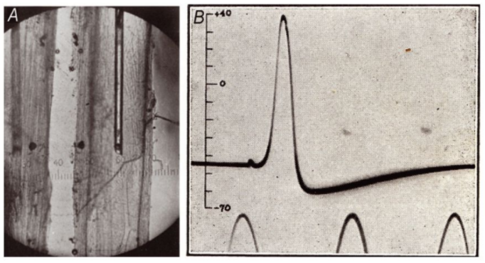
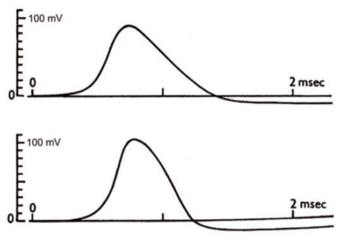

# Izhikevich neuron model simulator

This algorithm focus on the generation of a neural network model based on the Izhikevich neural model simulation. The Izhikevich neural model is based on the *Hodkin-Huxley neural model*, which involves the use of first-order ODEs for the ion channels activation functions in order to generate an ionic output flow.

The ionic current model obtained from their investigation is presented as follows.

$$E = mc^2$$

# Project tasks
- [x] Store all of the neuron classes of the Izhikevich model in order to provide the right parameters.
- [ ] Generate an object class for the Izhikevich neural model and its activities.
- [ ] Generate a random network algorithm to represent the connection between each of the neurons presented in a desired time period.
- [ ] Generate a visualization algorithm to represent the neural field response and the neural events for the evaluation time.
- [ ] Generate an evaluation algorithm to calculate the field response rythm as an EEG channel response.
